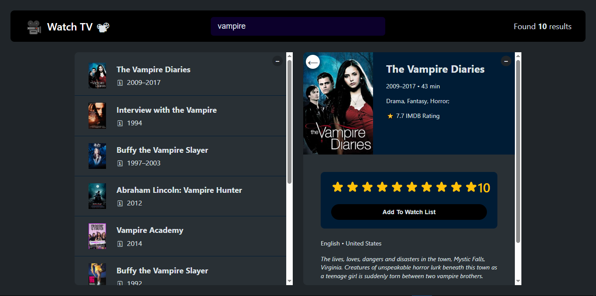

# 🎬 Watch TV – Movie Search and Watchlist App

This is a React-based movie search and watchlist application built using the [OMDb API](http://www.omdbapi.com/). Users can search for movies, view detailed info, and maintain a list of watched films with their personal ratings.

> ✅ This is a standalone project built during my React learning journey from Jonas Schmedtmann's course. I customized and deployed it to showcase my progress and skills.

---
## 📸 Screenshot

Here’s a preview of the app in action:



---

## 🔍 Features

- 🎥 Search movies by title via OMDb API
- 📄 View full movie details (IMDb rating, plot, director, actors, etc.)
- ⭐ Rate movies using a custom star rating component
- ✅ Add movies to your personal **Watched** list
- 🗑️ Remove movies from your watched list
- 📊 View watched movie stats (average IMDb rating, your ratings, average runtime)
- ⌨ Keyboard interaction (e.g. press `Escape` to close details)
- 🧠 Dynamic document titles

---

## 🛠 Tech Stack

- **React** (with functional components & hooks)
- **Axios** for API requests
- **OMDb API** as the movie database
- **CSS Modules / plain CSS** for styling
- **React state lifting & conditional rendering**

---

## 📦 Installation (for local use)

```bash
git clone https://github.com/ZakaDev22/watch-tv.git
cd watch-tv
npm install
npm start
